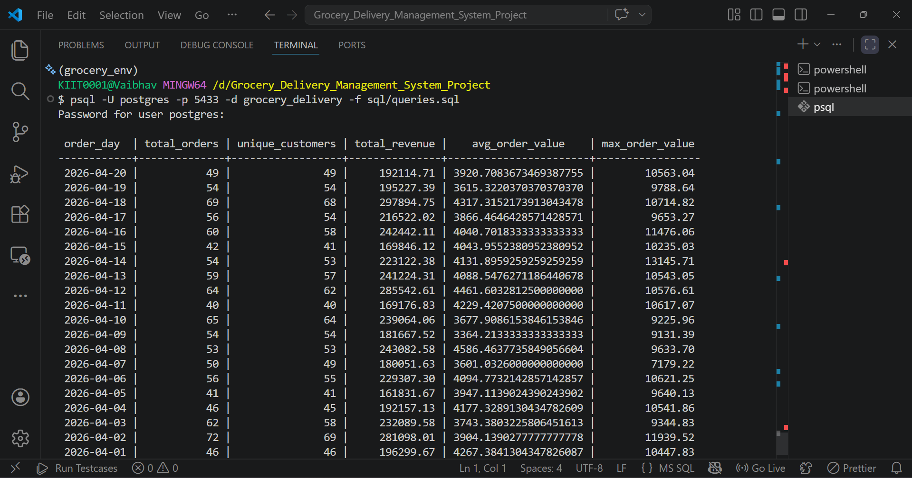
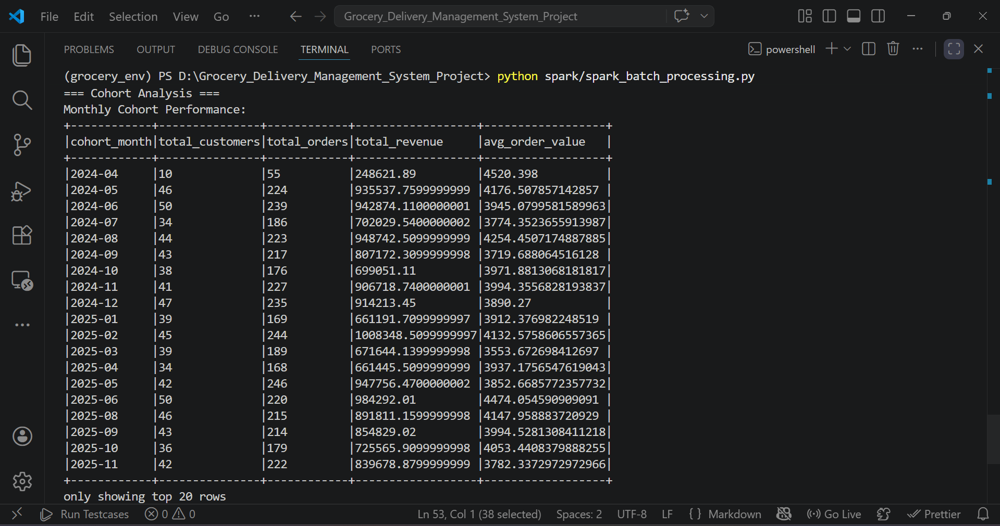
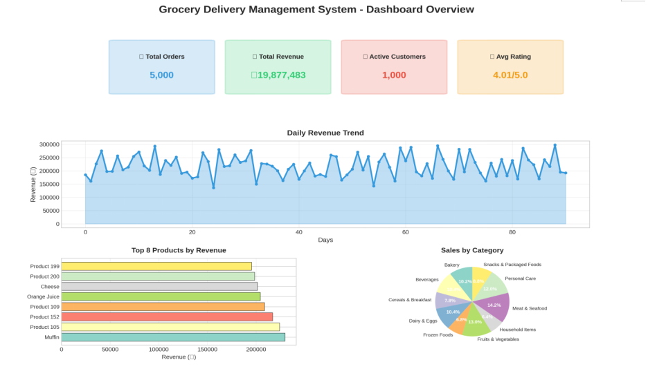

# 🛒 Grocery Delivery Management System - Data Engineering Project

[](https://www.python.org/)
[](https://spark.apache.org/)
[](https://kafka.apache.org/)
[](https://www.postgresql.org/)
[]()

An end-to-end **Data Engineering pipeline** for a grocery delivery system,
covering batch processing, real-time streaming, big data analytics, and workflow orchestration using **Spark, Kafka, PostgreSQL, and Airflow**.

## 📋 Table of Contents
- [Overview](#-overview)
- [Features](#-features)
- [Architecture](#-architecture)
- [Data Pipeline Flow](#-data-pipeline-flow)
- [Tech Stack](#-tech-stack)
- [Installation](#-installation)
- [Usage](#-usage)
- [Project Structure](#-project-structure)
- [Sample Analytics](#-sample-analytics)
- [Screenshots](#-screenshots)
- [Key Learnings](#-key-learnings)
- [Documentation](#-documentation)
- [Contributing](#-contributing)
- [Author](#-author)
- [License](#-license)

## 🎯 Overview

This project implements a complete data engineering solution for managing and analyzing grocery delivery operations. It covers the entire data lifecycle from ingestion to visualization, incorporating industry-standard tools and best practices.

### Problem Statement
Online grocery platforms generate massive amounts of data daily. This project builds a scalable data pipeline to:
- Process customer orders in real-time
- Track delivery performance
- Analyze sales trends
- Optimize inventory management
- Generate business intelligence reports

## ✨ Features

### Data Pipeline
- ✅ **Batch Processing**: ETL pipeline for CSV to PostgreSQL
- ✅ **Real-time Streaming**: Kafka-based event processing
- ✅ **Big Data Analytics**: PySpark for large-scale computations
- ✅ **Workflow Orchestration**: Airflow DAGs for automation

### Data Management
- ✅ **OLTP Database**: Normalized PostgreSQL schema
- ✅ **Data Warehouse**: Star schema for analytics
- ✅ **Data Quality**: Automated validation and cleaning
- ✅ **Data Modeling**: Fact and dimension tables

### Analytics
- ✅ **Sales Analysis**: Revenue, trends, forecasting
- ✅ **Customer Segmentation**: RFM analysis, cohorts
- ✅ **Delivery Metrics**: Performance tracking, optimization
- ✅ **Inventory Management**: Stock levels, turnover rates

## 🏗️ Architecture

```
┌─────────────┐      ┌──────────────┐      ┌─────────────┐
│   Data      │      │   Kafka      │      │   Spark     │
│  Sources    │─────▶│  Streaming   │─────▶│ Processing  │
│  (CSV/API)  │      │              │      │             │
└─────────────┘      └──────────────┘      └─────────────┘
                            │                      │
                            ▼                      ▼
                     ┌──────────────┐      ┌─────────────┐
                     │  PostgreSQL  │◀─────│   Airflow   │
                     │   Database   │      │Orchestration│
                     └──────────────┘      └─────────────┘
                            │
                            ▼
                     ┌──────────────┐
                     │ Data Warehouse│
                     │ (Star Schema) │
                     └──────────────┘
```

## 🔄 Data Pipeline Flow

1. Raw CSV data is generated and ingested
2. Data cleaning and validation using Pandas
3. ETL pipeline loads data into PostgreSQL
4. Spark performs batch analytics
5. Kafka streams real-time order events
6. Airflow orchestrates the entire pipeline

## 🛠️ Tech Stack

| Category | Technologies |
|----------|-------------|
| **Languages** | Python 3.8+, SQL |
| **Big Data** | Apache Spark (PySpark), Hadoop HDFS |
| **Streaming** | Apache Kafka |
| **Database** | PostgreSQL |
| **Orchestration** | Apache Airflow |
| **Data Processing** | Pandas, NumPy |

## 📦 Installation

### Prerequisites
- Python 3.8 or higher
- PostgreSQL 13+
- Apache Spark 3.4+
- Apache Kafka 2.0+
- Apache Airflow 2.6+

### Quick Setup

1. **Clone the repository**
```bash
git clone https://github.com/vaibhav21devlpr/Grocery-Delivery-Management-System.git
cd Grocery-Delivery-Management-System
```

2. **Install dependencies**
```bash
pip install -r requirements.txt
```

3. **Run setup script**
```bash
bash setup.sh
```

4. **Generate sample data**
```bash
python scripts/generate_data.py
```

5. **Run the pipeline**
```bash
python scripts/etl_pipeline.py
```

For detailed installation instructions, see [QUICKSTART.md](QUICKSTART.md)

## 🚀 Usage

### 1. Generate Sample Data
```bash
python scripts/generate_data.py
```
Creates 1000 customers, 200 products, 5000 orders

### 2. Clean and Validate Data
```bash
python scripts/data_cleaning.py
```
Performs data quality checks and cleaning

### 3. Load to Database
```bash
python scripts/etl_pipeline.py
```
ETL pipeline to PostgreSQL

### 4. Run Spark Analytics
```bash
spark-submit spark/spark_batch_processing.py
```
Big data processing and analytics

### 5. Real-time Streaming
```bash
# Terminal 1: Start producer
python kafka/producer.py

# Terminal 2: Start consumer
python kafka/consumer.py
```

### 6. Orchestrate with Airflow
```bash
airflow webserver -p 8080
airflow scheduler
```
Access UI at http://localhost:8080

## 📂 Project Structure

```
grocery_delivery_de_project/
│
├── 📄 README.md                    # Project documentation
├── 📄 QUICKSTART.md               # Quick start guide
├── 📄 requirements.txt            # Python dependencies
├── 🔧 setup.sh                    # Setup script
│
├── 📁 config/                     # Configuration files
│   ├── database.yaml
│   └── kafka.properties
│
├── 📁 data/                       # Data storage
│   ├── raw/                       # Raw CSV files
│   └── processed/                 # Cleaned data
│
├── 📁 sql/                        # SQL scripts
│   ├── schema.sql                 # Database schema
│   ├── star_schema.sql            # Data warehouse
│   └── queries.sql                # Analytics queries
│
├── 📁 scripts/                    # Python scripts
│   ├── generate_data.py           # Data generator
│   ├── data_cleaning.py           # Data cleaning
│   └── etl_pipeline.py            # ETL pipeline
│
├── 📁 spark/                      # Spark jobs
│   └── spark_batch_processing.py
│
├── 📁 kafka/                      # Streaming
│   ├── producer.py
│   └── consumer.py
│
├── 📁 airflow/                    # Orchestration
│   └── dags/
│       └── grocery_pipeline_dag.py
│
└── 📁 logs/                       # Application logs
```

## 📊 Sample Analytics

### Sales Performance
```python
Top 10 Products by Revenue:
- Chicken: ₹267,600 (892 orders)
- Rice: ₹171,200 (856 orders)
- Milk: ₹156,000 (780 orders)
```

### Customer Segmentation
```
Premium Customers: 45 (Avg LTV: ₹65,000)
Gold Customers: 123 (Avg LTV: ₹35,000)
Silver Customers: 287 (Avg LTV: ₹15,000)
Bronze Customers: 545 (Avg LTV: ₹5,000)
```

### Delivery Metrics
```
Average Delivery Time: 35 minutes
On-time Delivery Rate: 87%
Customer Satisfaction: 4.3/5.0
```

## 📸 Screenshots

### 🔹 SQL Query Results


### 🔹 Spark Processing Output


### 🔹 Dashboard / Visualization


## 🔑 Key Learnings

This project demonstrates proficiency in:

1. **Data Engineering Fundamentals**
   - ETL/ELT pipeline design
   - Data modeling (3NF, Star Schema)
   - Data quality and validation

2. **Big Data Technologies**
   - Apache Spark for distributed processing
   - Apache Kafka for real-time streaming
   - Hadoop HDFS for distributed storage

3. **Database Design**
   - OLTP vs OLAP systems
   - Indexing and query optimization
   - Slowly Changing Dimensions (SCD)

4. **Workflow Orchestration**
   - Airflow DAG development
   - Task dependencies
   - Monitoring and alerting

5. **Best Practices**
   - Code modularity and reusability
   - Logging and error handling
   - Documentation and comments

## 📝 Documentation

- **[README.md](README.md)**: Complete project overview
- **[QUICKSTART.md](QUICKSTART.md)**: Quick start guide

## 🤝 Contributing

This is an educational project for academic purposes. If you'd like to suggest improvements:

1. Fork the repository
2. Create a feature branch
3. Commit your changes
4. Push to the branch
5. Create a Pull Request

## 👤 Author

**Vaibhav Pandey**
- Roll Number: 2306078
- Program: Data Engineering
- Institution: Kalinga Institute of Industrial Technology
- Email: 2306078@kiit.ac.in

## 📄 License

This project is created for educational purposes as part of a Data Engineering Capstone Project.

## 🙏 Acknowledgments

- Course instructors and mentors
- Apache Software Foundation for open-source tools
- Data Engineering community

---

**⭐ If you find this project helpful, please give it a star!**

**📧 For queries, reach out via email or create an issue**
